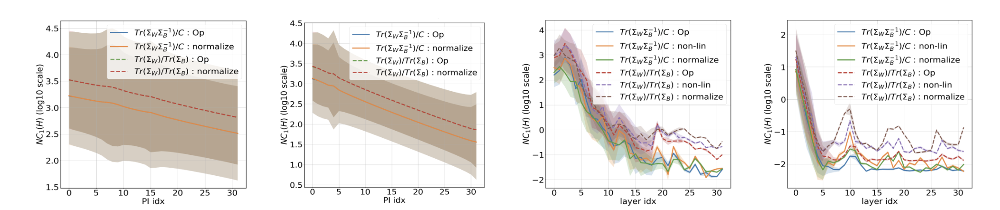

# Exploring neural collapse in graph neural networks

This repo contains the code for our NeurIPS 2023 [paper](https://arxiv.org/abs/2307.01951) titled "A Neural Collapse Perspective on Feature Evolution in Graph Neural Networks". In this work, we especially focus on the role of graph structure in facilitating/hindering the tendancy towards collapsed minimizers.

<div align="center">
  
  <p align="center"> <b>NC1</b> metrics across projected power iterations and GNN layers.</p>
</div>

## Setup

```bash
$ python3.9 -m virtualenv .venv
$ source .venv/bin/activate
$ pip install -r requirements.txt
```

## Data

We randomly sample graphs from the stochastic block model to control the properties of planted communities. The `SBM` class in `gnn_collapse.data.sbm` is an instance of `torch_geometric.data.Dataset` and facilitates direct encapsulation with torch `DataLoader`. Currently, we support the following feature strategies:

```python
class FeatureStrategy(Enum):
    EMPTY = "empty"
    DEGREE = "degree"
    RANDOM = "random"
    RANDOM_NORMAL = "random_normal"
    DEGREE_RANDOM = "degree_random"
    DEGREE_RANDOM_NORMAL = "degree_random_normal"
```

## Experiments

We employ a config based design to run and hash the experiments. The `configs` folder contains the `final` folder to maintain the set of experiments that have been presented in the paper. The `experimental` folder is a placeholder for new contributions. A config file is a JSON formatted file which is passed to the python script for parsing. The config determines the runtime parameters of the experiment and is hashed for uniqueness.

To run GNN experiments:
```bash
$ bash run_gnn.sh
```

To run gUFM experiments
```bash
$ bash run_ufm.sh
```

To run GNN experiments with larger depth
```bash
$ bash run_gnn_deeper.sh
```

To run spectral methods experiments
```bash
$ bash run_spectral.sh
```

A new folder called `out` will be created and the results are stored in a folder named after the hash of the config.

## Citation

```bibtex
@misc{kothapalli2023neural,
      title={A Neural Collapse Perspective on Feature Evolution in Graph Neural Networks}, 
      author={Vignesh Kothapalli and Tom Tirer and Joan Bruna},
      year={2023},
      eprint={2307.01951},
      archivePrefix={arXiv},
      primaryClass={cs.LG}
}
```

## Contributing

Please feel free to open [issues](https://github.com/kvignesh1420/gnn_collapse/issues) and create [pull requests](https://github.com/kvignesh1420/gnn_collapse/pulls) to fix bugs and improve performance.

## License

[MIT](LICENSE)